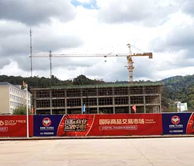
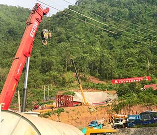
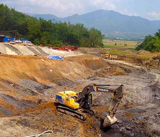
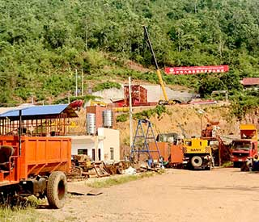
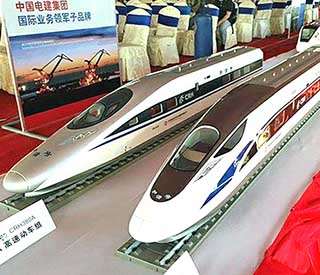
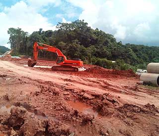

A high-speed railway connecting Laos to China is among Beijing’s most aggressive investment forays into Southeast Asia. The U.S. $6 billion project will stretch 409 km (254 miles) from the Lao-China border to the Lao capital, Vientiane.

The railway – which will eventually run from Kunming in southwestern China through Laos, Thailand, and Malaysia to Singapore – is a key component of China’s signature global infrastructure plan, the ambitious Belt and Road Initiative.

China is now the top investor in Laos, and Chinese companies are pouring billions of dollars into Special Economic Zones, dams, mines, and rubber plantations. Beijing hopes the aid and investment will draw the landlocked Southeast Asian nation, a former French colony with close ties to its communist mentor state Vietnam, into Beijing’s orbit.

Laos, an impoverished nation of nearly 7 million people, is looking to boost socioeconomic development through trade, manufacturing, tourism, and sales of electricity produced by damming the Mekong and other big rivers. The Lao-China railway is a signature part of that effort.

More than 3,800 hectares (9,500 acres) of land have been reserved for the mega-project, and an estimated 4,411 families will be relocated, Rattanamany Khounnivong, deputy minister at the Lao Ministry of Public Works and Transport and one of the heads of the construction unit for the single-track, standard-gauge rail network, told RFA’s Lao service.

Since the groundbreaking ceremony for the railway in December 2016, workers have been blasting tunnels in mountains, building bridges and roads, and clearing land for stations and substations along the planned rail line in the three northern Lao provinces of Luang Namtha, Oudomxay, and Luang Prabang.

Officials have recruited more than 7,000 Lao workers to build the railway, most of them residents who live near the project, Rattanamany said.

The planned rail network will have 33 stations, of which 21 would be operational initially, according to the Ministry of Public Works and Transport. There will be 72 tunnels and 170 bridges. Passenger trains will travel at a speed of 160 km per hour, while the speed of rail freight will be 120 km per hour.

“[Laos was] left with no real alternative but to accept large-scale Chinese investment in infrastructure, even if it meant accepting the economic and political influence that comes with it,” researcher Michael Hart wrote in the Dec. 20, 2017 issue of World Politics Review. “The risk of rebuffing Beijing was too great, as sustained growth and faster development are vital to ensure the legitimacy of the ruling party.”

China also benefits from the arrangement, with Beijing now able to count on Lao support in ASEAN for China’s claims in the South China Sea, Hart wrote.

<iframe src="https://www.youtube.com/embed/o2HDz0zKU4Y" frameborder="0" allowfullscreen></iframe>

### Compensation questions slow construction ###

Political and financial setbacks have delayed the Lao-China stretch of the railway. The original construction plan called for work to begin in 2011 and be completed in 2015, but the plans now call for the railway to be completed in 2021.

Some villagers who were forced to leave their homes say they are still waiting for compensation from the government.

“We know we will be compensated for sure, but we have no idea when we will get paid,” a resident of Luang Prabang who had to give up his house and land for the project told RFA.

Previously, the government took into account only the cost of roof bricks and other material when determining what to pay villagers for the loss of their homes, said the man who requested anonymity.

“But officials have not come to talk about compensation for the land,” he said.

The seizure of land for development—often without due process or fair compensation for displaced residents—has been a major cause of protest in Laos and other authoritarian Asian countries, including China, Cambodia, and Myanmar. In communist countries, where all land formally belongs to the state, land use and property rights can be complicated.

The Lao government expects the project’s steering committee to approve the final compensation scheme, though assessments of the social and environmental impact of the railway are taking time, Rattanamany told RFA’s Lao Service.

There are 242 different categories of compensation to be considered, such as that for jackfruit and mango trees five years of age or older, hardwood and teak trees less than a year old, and land near main roads, he said.

“The number of fruit trees and so on must be included to evaluate the compensation for those affected,” Rattanamany said. “In doing so, we must collect proper data to ensure accuracy.”

Though construction work has begun on state land, workers have not yet bulldozed other places, because the people who live there must be compensated before clearing activities can begin, he said.

“We have not touched their land, but we have informed them of the project and listened to their needs,” he said.

Rattanamany also said officials are evaluating the amount of money to be paid for land according to market prices to ensure people receive fair compensation. This is being done with the participation and the consent of the people, he said.

“This is not considered a delay [because] we are implementing it in accordance with the process,” he said. “We would like to rush to do it, but everything must follow the process and be based on the satisfaction of the people.”

He went on to say that officials have not evaluated all the costs and cannot finalize the total number of affected families and timing because companies working on the project have not yet completed the railway’s demarcations.

### Villagers still waiting for information ###

Villagers whose homes, land, and farmland are affected by the project told RFA that they are still waiting to learn how much compensation they will receive, where they will be relocated, and the dates of their relocations.

Some say that work on the railway has already cut through their land, though they have received no compensation.

In May, an official in Luang Namtha province told RFA that about 20 families from Nateuy village in Luang Namtha district have had to leave their houses and farmland to make way for the project, but they still do not know where they are going to live.

“We do not know where those villagers who have been affected will be relocated,” he said. “The [Lao People’s Revolutionary] Party and government are still working on the plan. There will be about 20 families relocated, but we will try to find some land for them not far from their current village.”

{:.pullquote.balance-text}
“Some villagers are really in trouble. They need some money to build their new houses. They request that all the villagers who are affected be compensated. However, we have gotten no answer from the relevant bodies.”

An official from Oudomxay province told RFA in May that the railway project’s Chinese contractor, state-owned China Railway Corporation, had brought workers to the province’s Xai district to begin drilling tunnels and making adjustments to farmland on which 200 villagers currently live.

The Chinese engineering team is building roads and tunnels that cut through the villagers’ farmland, he said.

“However, there has been no talk of compensation or the relocation plans for the affected villagers because it is a matter for the Lao government,” he said.

“We are not against the project, but we need the Party and government to fairly compensate those who are affected according to the market price for the land, which is in a business zone,” the official from Oudomxay province said.

“We also want to know when, how, and how much we will be compensated,” he said. “Some villagers are really in trouble. They need some money to build their new houses. They request that all the villagers who are affected be compensated. However, we have gotten no answer from the relevant bodies.”

<!--

-->

<!--

-->

<!--

-->

<!--

-->

<!--

-->

<!--
-->

{:.bbg__cutline}
(Select a thumbnail to see construction photos along the railway.)

### Concerns over transparency, jobs ###

Also speaking to RFA, other sources voiced concerns over lack of transparency in the payment process in a country notorious for corruption and lacking independent media.

“Of course I worry about compensation,” a resident of Nong Vieng Kham Village in the capital, Vientiane, said.

“I don’t want there to be any leaks [of the funds], and I don’t want any ‘middle men’ to be involved,” RFA’s source said, speaking like the others interviewed on condition of anonymity.

“If the government pays us $500 per square meter, I want to receive $500 - not $200 or $300,” he said.

Fasanan Thammavong, director general of Luang Prabang province’s public works and transport department, told RFA’s Lao Service that his department is reaching out to the people affected by the construction. But he admitted that they are still ironing out the final details.

“Our duty is to cooperate and negotiate with the affected people for the government,” he said. “In Luang Prabang, the number of affected families as well as compensation are not finalized yet, and more details are being collected and studied.”

While officials told RFA that Lao workers would be hired to operate the heavy equipment, Fasanan declined to say how many Chinese workers will be employed to build the project.

“They hired Lao workers to use heavy equipment to clear the land,” he said. “So far only the Chinese technical team is here. Their workers are not here yet.”

It has been previously reported that more than 50,000 mostly Chinese workers will be hired to build the project.

A source in Oudomxay province’s Xay district told RFA that four villas are being built to accommodate Chinese workers in area. About 100 Chinese workers are already in the province, the source said, and they are gearing up for the railway’s construction.

Fasanan told RFA that he is unsure how many Laos will be hired in his district.

“I do not know more details on the Lao workers who will work on the project,” he said.

Minister of Labor and Social Welfare Khampheng Saysompheng recently told local media that his ministry has yet to be told about the make-up of the workforce.

“We still don't know what kinds of skills are needed,” he said after a December meeting in Vientiane of the cabinet, Vientiane mayor, and provincial governors, according to the Vientiane Times.

Lao villagers attending a meeting on October 27, 2017 promoting the project were blocked from asking questions about compensation and where they will be moved when displaced from their land, Lao sources told RFA at the time.

The meeting brought together more than a hundred residents of Nathom, Nongviengkham, Donenoun, and other villages in the Xaythany district of Laos’ capital Vientiane, and was convened by a district-level committee formed to boost the project, sources said.

But participants quickly came to feel that officials were ignoring their concerns, one woman who attended the meeting told RFA’s Lao Service.

“When the villagers wanted to ask questions, the authorities would not allow them to do so,” RFA’s source said, speaking on condition of anonymity. “So many of us became angry and left the meeting before it had really ended.”